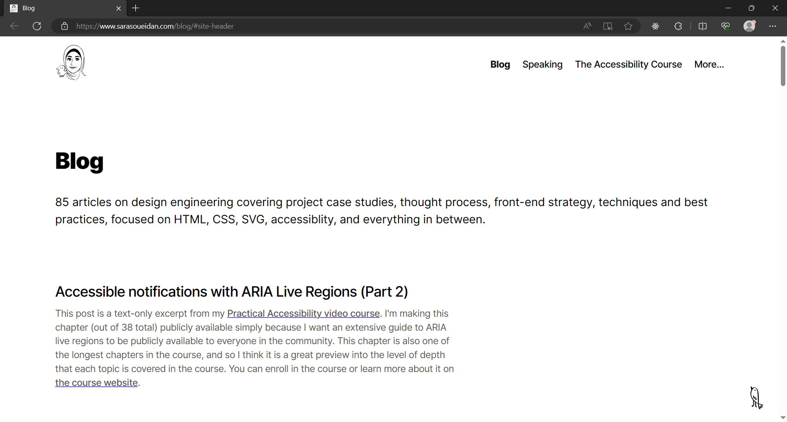

# K-Back-To-Top

_#WebComponent_

Back-to-top button. `<k-back-to-top>`

[Demo: The Principles of Newspeak.](https://kaitos-back-to-top.vercel.app/)

    

## Tools used

- ChatGPT 4: Generate the image (as WEBP).

- FFMpeg: Convert the image to PNG.

- Inkscape: Trace the bitmap to vector SVG.

- [SVGOMG](https://jakearchibald.github.io/svgomg/): Optimize the SVG.

## Background

Inspired by Sara Soueidan's design, except it's a howling jackal/wolf.

## Links

- Inspiration:
[Sara Soueidan's Blog](https://www.sarasoueidan.com/blog/)

- [Back-to-Top Button Design Guidelines | NNGroup](https://www.nngroup.com/articles/back-to-top/)

- Demo text:
[APPENDIX. The Principles of Newspeak from _Nineteen eighty-four_ by George Orwell](https://gutenberg.net.au/ebooks01/0100021h.html#ch24)

---

END.
